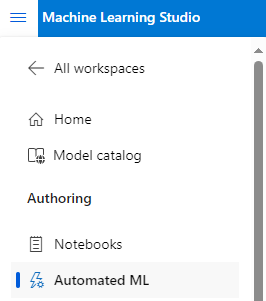
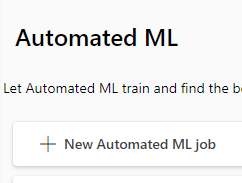
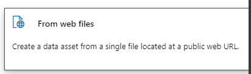
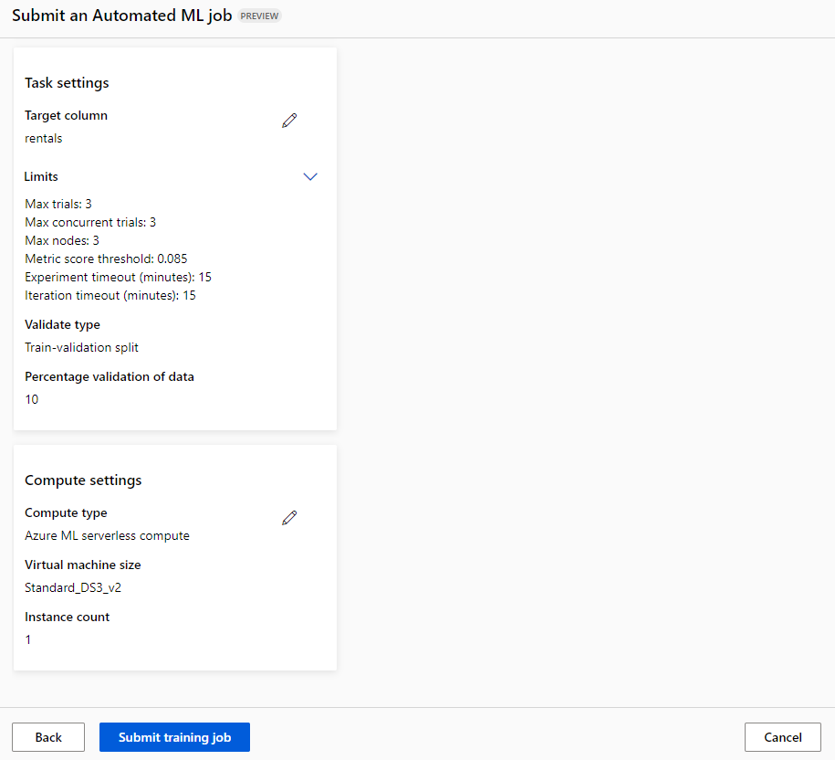
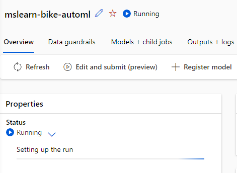

# dio_ml_azure
Repositório para realizar exercícios referente ao bootcamp Machine Learning na Prática no Azure ML

** Etapa Inicial - Criação do Recurso **
A etapa inicial consistiu na criação do recurso Machine Learning Studio, realizado através do portal da Azure. Após as configurações para criação (como definição do nome, storage, resorce group) o recurso é criado.

** Segunda Etapa - Acessando o Recurso **

Para acessar o Machine Learning Studio basta voltar a página inicial no https://portal.azure.com e buscar pelo nome dado ao recurso criado. Ao acessar o Azure Machine Learning Workspace uma nova página será aberta, agora dentro do recurso na sessão Overview. 
Para acessar o Machine Learning Studio basta clicar em Lauch Studio nessa mesma sessão de Overview.

Durante a primeira vez que o ML Studio for executado será solicitado o preenchimento de algumas informações. Após preenchidas, o ambiente estará liberado para criação de modelos.

** Terceira Etapa - Criando um Modelo ** 

Na página inicial do Machine Learning Studio basta clicar no sandwich ícone ao lado superior esquerdo e após, na sessão Authoring, clicar em Automated ML (demonstrado na figura 1.0 abaixo).

A página de criação do Automated ML será aberta e para criar um novo Job basta clicar em New automated ML job (figura 1.1).

Para esse recursos iremos seguir com os exemplos dados na documentação (https://microsoftlearning.github.io/mslearn-ai-fundamentals/Instructions/Labs/01-machine-learning.html).

Portanto o job name será: mslearn-bike-automl
New experiment name: mslearn-bike-rental
Description: Automated machine learning for bike rental prediction
Tags: Nenhuma

Após essas informações preenchidas, basta clicar em Next.

Task type & data: Regression
Clicar em Create para criação de um novo data asset com as seguintes informações:

Name: bike-rentals
Description: Historic bike rental data
Type: Tabular

Na aba Data Source basta selecionar "From web files"(figure 1.2):

Na aba Enter a web URL iremos inserir a URL: https://aka.ms/bike-rentals 
Não ativar o skip data validation.

Após essa etapa, a etapa Settings estará disponível, nessa etapa iremos configurar:
File format: Delimited
Delimiter: Comma
Encoding: UTF-8
Column headers: Only first file has headers
Skip rows: None
Dataset contains multi-line data: não marcar a caixa

Na aba Schema:
Selecionar todas as colunas com exceção da coluna "Path".

Após essa etapa, será necessário revisar o data asset configurado e confirmar sua criação.

Após a criação iremos retornar a página do Training Job e em Select Data estará visível o data asset configurado. Iremos selecioná-lo e clicar em next. 

Abrirá a página de configuraçãode Task settings e iremos configurar da seguinte maneira:

Task type: Regression
Dataset: bike-rentals
Target column: Rentals (integer)
Clicaremos em Additional configuration settings e:
    Primary metric: Normalized root mean squared error
    Explain best model: Não selecionar.
    Use all supported models: Não selecionar.
    Allowed models: Selecionar apenas RandomForest e LightBGM.
Limits: Expandir a sessão e configurar:
    Max trials: 3
    Max concurrent trials: 3
    Max nodes: 3
    Metric score threshold: 0.085
    Timeout: 15
    Iteration timeout: 15
    Enable early termination: Selecionar
Validation and test:
    Validation type: Train-validation split
    Percentage of validation data: 10
    Test dataset: None

Após configurar clicar em next.

A aba Compute surgirá e será necessário selecionar:
Select compute type: Serverless
Virtual machine type: CPU
Virtual machine tier: Dedicated
Virtual machine size: Standard_DS3_V2*
Number of instances: 1

Após a configuração de compute será aberta uma aba para verificar os dados preenchidos. Após a validação clique em "Submit training job" no canto inferior esquerdo (figura 1.3).

Após alguns minutos o Job irá iniciar sua execução (figura 1.4):

Após aproximadamente 15min será possível realizar as análises e testes do modelo criado.
